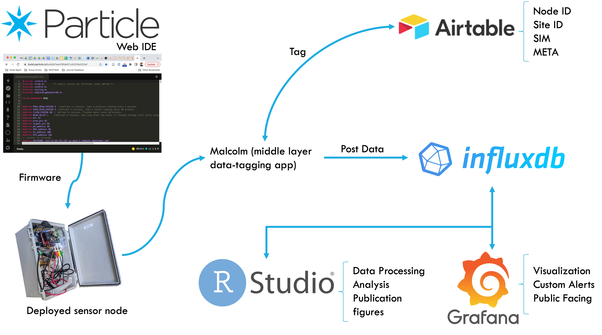
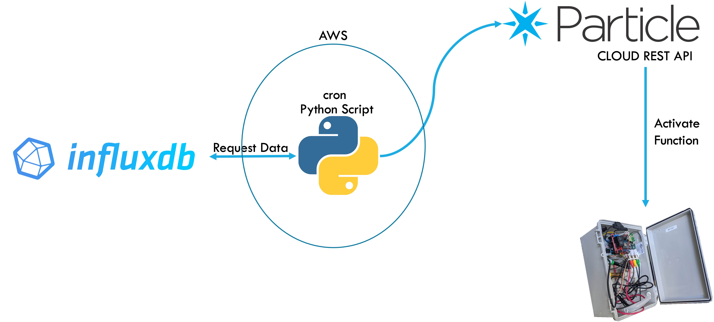

```{r setup, include=FALSE, eval=TRUE}
knitr::opts_chunk$set(include = TRUE, echo = FALSE, message = FALSE, warning = FALSE, fig.width=10, fig.height=8)
library(readxl)
library(leaflet)
library(mapview)
library(sf)
library(viridis)
library(tidyverse)
library(magrittr)
#, base_family = "sans"
library(ggplot2); theme_set(theme_bw(base_size = 12) + theme(plot.title = element_text(size = 22), axis.text = element_text(size = 13), axis.title=element_text(size = 13), legend.text=element_text(size = 12), legend.title=element_text(size = 13), legend.key.size=unit(0.75,"cm"), strip.text=element_text(size=13),panel.grid.major = element_blank(), panel.grid.minor = element_blank(),
panel.background = element_blank(), axis.line = element_line(colour = "black")))
library(dplyr)
library(data.table)
library(plotly)
library(ragg)
library(hrbrthemes)
library(DT)
library(cowplot)
library(svglite)
library(mxmaps)
library(rgdal)
library(fuzzyjoin)
library(zoo)
library(tidyquant)
library(recipes)
library(sp)
library(timetk)
library(ggbreak)
library(spectral)
library(rstatix)
library(qwraps2)
library(lubridate)
library(here)
library(ggtext)
library(english)
library(kableExtra)
library(naniar)
WD <- getwd()
if (!is.null(WD)) setwd(WD)
source("/Users/ernestof/Dropbox (University of Michigan)/from_box/Ernestom Macbook Air/UMICH/Research/My Research/Realtime water systems lab/RStudioCoding/influxtimeseriesfunctions.R")
#function name is fetchinflux(node_id,parameter,t_start,t_end,tz) and inter_thresh(data,mintime)

```

# Goal
The objective of developing a smart wireless sensor network is to measure, analyze, interpret data, and communicate in real-time. In dynamic systems, a smart application usually is in the form of a control that is applied as a correcting factor. For example, a valve used to control fluids has an actuator that can open or close the valve remotely depending on a determined system state. 
To perform a task as simple as opening a valve there must be an established back-end communication and data analysis infrastructure, especially when dealing with a vast wireless sensor/actuator network. Here I explain how the communication channels were coded into the sensor node's firmware and how a simple application hosted in AWS is able to transform a static sensor network to a smart wireless sensor. 

# Architecture
The cloud architecture of the wireless sensor network is built upon layers of commercial IoT services including Particle, Influxdb, Grafana, and Airtable. 
Particle provides the back-end infrastructure for users to manage deployed devices. Through Particle's Web IDE the custom firmware is directly flashed and uploaded through the air. Particle also offers a dashboard to monitor all devices status, including amount of data transferred per month/billing cycle, connectivity strength, and other diagnostics. 
Deployed nodes send data in realtime from the field to a middle layer that is retroactively communicating with Airtable and tagging each data point with metadata such as location, site id, and other useful information that shouldn't have to be sent over and over again by the deployed node itself (expensive!). After the data is tagged is posted to the data base, for which maintenance, development, and service is provided by InfluxDB. Data visualization and analysis tools request data directly from InfluxDB. These connections make real-time data possible. Documentation for setting up the server-side architecture can be found at [github.com/kLabUM](https://github.com/kLabUM) or at [github.com/open-storm](https://github.com/open-storm).



The cloud architecture with the existing web-services can be expanded and customized as needed. Next I show examples on how to use these online services to build a smart valve actuator. Particle, Influx, and a simple python data-analysis app hosted in Amazon Web Services turn the static real-time monitoring sensor network into one that can react depending on the system's state.




## Device-side Particle Functions (C++)

Particle's recipe is used to create to create custom cloud functions. In the chunk below the cloud function is initiated within the `void setup(){}` using the following syntax `Particle.function("Smart Flush",smart_flush)`. Then the function is defined as `int smart_flush(String argument)` as any other function. This function is part of the firmware of each node and it will be accessible through Particle's Cloud API as shown in the architecture above. You can read the [documentation](https://docs.particle.io/reference/device-os/api/cloud-functions/particle-function/) and instructions about how to write Particle cloud functions.

```{r engine='Rcpp', echo=TRUE, eval=FALSE}
#include <Rcpp.h>
using namespace Rcpp;

// [[Rcpp::export]]

#define bfc D7
unsigned long previousMillis_smartflush = 0; // used for smart flush and keep at least at 4 hr separation
unsigned long minsmartflushseparator = 4*60*60*1000; //minimum hours in milliseconds between smart flush being activated again
bool smart_flush_on=FALSE;    //indicator to keep track of the fixed flushing each day
int maxsmartflushTime = 15; //defined in minutes

void setup() {
    
    pinMode(bfc, OUTPUT);  //commented out because not using beef cake -- well we back here again fool!  //Sets digital pin as output to the relay switch
      //flushing function for smart flushing
    Particle.function("Smart Flush",smart_flush);
}

void loop(){
    
    if (smart_flush_on && (currentMillis - previousMillis_smartflush >= maxsmartflushTime*60*1000)) {
        digitalWrite(bfc,LOW); //turn on beefcake (and therefore valve)
        smart_flush_on = FALSE; //adjust the indicator
    }
    
    if(smart_flush_on){
        timestamp = String(Time.now())+"000000000";
        take_temp("");
        take_ORP("");
        take_ORPdup("");
        //take_pH("");
        take_EC("");
        take_pressure("");
    }
}

//function used with a Python code to activate smart flushing based on cloud-analyzed data. Arg is HIGH or LOW depending if want to turn on or off the valve. n is the type of behavior the flush is addressing (sent from the pythin code)
int smart_flush(String position){
    
    bool arg;
    String n;
    //Evaluates first part of the position string that sets the valve on or off
    if(position.startsWith("HIGH")){
        arg = HIGH;
    }else if(position.startsWith("LOW")){
        arg = LOW;
    }else {return -1;}
    
    //evaluates the last character of the string, which represents the type of flush required (1, 2, or 3)
    if(position.endsWith("1")){
        n = "1";
    }else if(position.endsWith("2")){
        n = "2";
    }else {n="3";
    }
    
    int i=0;
    unsigned long currentflushMillis = millis();
    String tiename = "SmartFlush"+n;
    
    if(arg && ((currentflushMillis - previousMillis_smartflush >= minsmartflushseparator) || previousMillis_smartflush==0)){
        smart_flush_on=TRUE;
        previousMillis_smartflush = currentflushMillis;     // save the last time valve was opened taken
        timestamp = String(Time.now())+"000000000";
        createDataStream(tiename, "1");
        i = 1;
        digitalWrite(bfc,arg); //turn on beefcake (and therefore valve)
    }else{
        smart_flush_on=FALSE;
        i=0;
        digitalWrite(bfc,LOW); //turn on beefcake (and therefore valve)
        }
    
    
    
    return i;
}
```


## Server-side script (Python)

Now that the cloud function is defined and in the node's firmware, the Particle Cloud API is used to activate it. The function can be called directly from this python app using `url =  f”https://api.particle.io/v1/devices/{device}/Smart%20Flush”` followed by `data = {“arg”:“HIGH3", “access_token”:“REDACTED”}` and finally `requests.post(url, data)`. The access token is unique to each user account so it is redacted here. You can establish communication channels between your apps in other web services using [Particle's Cloud API](https://docs.particle.io/reference/cloud-apis/api/) and [web hooks](https://docs.particle.io/getting-started/integrations/webhooks/).

This simple app also requests data from influxdb using `s = bounded_time_query()` which is a custom function not shown, posts slack messages to specific channels. The app was written to run a query, analyze the data, and depending on the outcome activate the "Smart Flush" cloud function through particle's cloud api. 

```{r engine='python', echo=TRUE, eval=FALSE}

import os
from datetime import datetime, timedelta
import pytz
import time
import sys
import requests
from slack_sdk import WebClient
from slack_sdk.errors import SlackApiError
slack_token = “REDACTED”
def slack_message_api(slack_channel, slack_message):
  slack_client = WebClient(token=slack_token)
  try:
    response = slack_client.chat_postMessage(
      channel= slack_channel,
      text=slack_message
    )
  except SlackApiError as e:
    # You will get a SlackApiError if “ok” is False
    assert e.response[“error”]  # str like ‘invalid_auth’, ‘channel_not_found’
def writeto_node(node_id):
  devices = {“NODE1”:“DEVICE_ID”,
        “NODE2”:“DEVICE_ID”,
        “NODE3”:“DEVICE_ID”,
        “NODE4”:“DEVICE_ID”,
        “NODE5”:“DEVICE_ID”,
        “NODE6”:“DEVICE_ID”,
        "NODE7":"DEVICE_ID"} 
  device = devices[node_id]
  thresholds = {“NODE1”:350,
        “NODE2”:400,
        “NODE3”:340,
        “NODE4”:400,
        “NODE5”:305,
        “NODE6”:350,
        "NODE7":700}
  threshold = thresholds[node_id]
  url = f”https://api.particle.io/v1/devices/{device}/Smart%20Flush”
  t_end = datetime.strftime(datetime.now(pytz.utc), “%Y-%m-%dT%H:%M:%S.000000000Z”)
  t_start = datetime.strftime(datetime.now(pytz.utc) - timedelta(minutes = 60), “%Y-%m-%dT%H:%M:%S.000000000Z”)
  s = bounded_time_query(client_user, field=‘value’, measurement=‘Temp’, tags={‘node_id’ : node_id},
                t_start=t_start, t_end=t_end)
  df = pd.DataFrame({‘Temp’ : s})
#  df.index = df.index.floor(‘min’) #Rounds datetime index to the nearest minute.
  s = bounded_time_query(client_user, field=‘value’, measurement=‘ORP’, tags={‘node_id’ : node_id},
                t_start=t_start, t_end=t_end)
  s = pd.DataFrame({‘ORP’ : s})
#  s.index = s.index.floor(‘min’)
#  df = s.copy()
  df = pd.concat([df, s], axis=1) #concatenate Temp and ORP into same df using the same index.
  df = df.assign(ORP_SHE = df[‘ORP’] + 225 - 262.55 + 1.5111*df[‘Temp’]) #Convert ORP_Ag-AgCl to the SHE
  df = df.assign(ORP_roll = df[‘ORP_SHE’].rolling(3).median()) #median filter applied to the ORP_she column
  df = df.assign(ORP_diff6 = df[‘ORP_roll’].diff(periods=6)) #apply difference within the same column 6 rows apart.
  if len(df) > 0:
    if ((df[‘ORP_diff6’]< -20).any()): #if a drop in the ORP signal greater than 20mV occurs then flush.
      data = {“arg”:“HIGH3", “access_token”:“REDACTED”}
      r = requests.post(url, data = data)
      print(r)
      slack_message_api(slack_channel=“qaqc”, slack_message= f”<@userid> SMART FLUSHY: ORP for {node_id} is wildin :(“)
    elif ((df[‘ORP_roll’][-1] < threshold).any()): #else if any value is below the ORP signal threshold then flush.
      data = {“arg”:“HIGH3", “access_token”:“REDACTED”}
      r = requests.post(url, data = data)
      print(r)
    else:
      print(“did not update device!“)
  else:
    print(“no data”)
              
  #This function may be expanded to smart STOP flushing by measuring temperature or ORP in realtime. Develop and implement here. 
  #Argument would be as data = {“arg”:“LOW", “access_token”:“REDACTED”}

writeto_node(“NODE1”)

```
