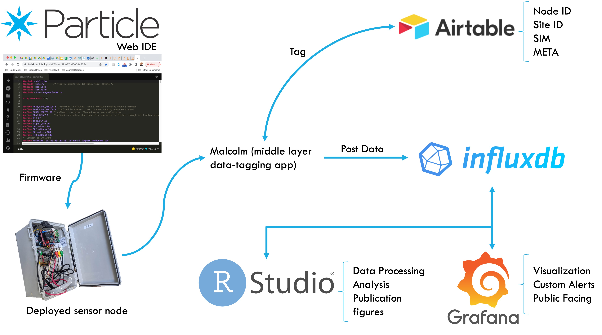

## Portfolio

---

### Real-time Water Quality Sensing

[Node Architecture and Deployments](/Project1.html) 
Learn how I built and deployed drinking water quality sensor nodes under kitchen sinks that measure water quality and relay data through the internet in real time. Here I compile information and data from our deployment locations in Mexico City and Ann Arbor. I include some of the R code I wrote to summarize and plot the signals.

---
Smart Flushing of Building Plumbing Taps 
I designed an experiment to automatically flush building plumbing water using the same sensor nodes. For this experiment I developed an algorithm to process sensor data in real time to autonomously actuate the valve - think robotics. This experiment required a bit more cloud computing. Learn about my solution.

This branch is under construction.

---

### Coding for cloud solutions
[Cloud Architecture and Smart Tools](/CloudSolutions.html) 

### NESTSMX
This section is under construction

### Publications
1. **Ernesto F. Martinez Paz**, Lutgarde Raskin, Krista R. Wigginton, Branko Kerkez. "Automatic and Smart Flushing of Building Plumbing Tap Water Using Oxidation-Reduction Potential (ORP) and Temperature Sensors. _in preparation_. exp. 2023.

1. **Ernesto F. Martinez Paz**, Meagan Tobias, Estefania Escobar, Lutgarde Raskin, Elizabeth F. S. Roberts, Krista R. Wigginton, and Branko Kerkez. "Wireless Sensors for Measuring Drinking Water Quality in Building Plumbing: Deployments and Insights from Continuous and Intermittent Water Supply Systems." _ACS ES&T Engineering_ **2022** 2 (3), 423-433
DOI: [10.1021/acsestengg.1c00259](https://pubs.acs.org/doi/abs/10.1021/acsestengg.1c00259)

### Presentations
1. **Ernesto F. Martinez Paz**, Krista R. Wigginton, Lutgarde Raskin, and Branko Kerkez. "Adaptive Flushing of Building Drinking Water Taps Using Real-Time Oxidation-Reduction Potential (ORP) and Temperature Signals." _Hydroinformatics Conference_. Bucharest, Romania. July 2022. [slides](/pdf/hic2022_martinezpaz.pdf) 

2. **Ernesto F. Martinez Paz**, Faith Cole, Branko Kerkez, Elizabeth F. S. Roberts. "Sensing Water in Mexico City." _Institute for Social Research_ at The University of Michigan. February 2022.

2. Cheng Yang, **Ernesto F. Martinez Paz**. "Chalk Talk: Introduction to Machine Learning." _Environmental Biotechnology Group_ at The University of Michigan. August 2020 

3. **Ernesto F. Martinez Paz**, Ana Bernal, David Palma, Krista R. Wigginton, Branko Kerkez, Elizabeth F. S. Roberts. "Mixed Methods for Monitoring Drinking Water in Mexico City." _Sustainability and Development Conference_. Ann Arbor, Michigan. October 2019.

### Master's Project – Dow Sustanability Fellowship

In 2018 I was awarded the Dow Masters Sustainability Fellowship at the University of Michigan and was involved in a 1-year long project working with a client. Together with my multidisciplinary team, we wrote this report for our client, [Isla Urbana](https://islaurbana.org/english/), where we detailed our findings and recommendations that would help them conceptualize a _conflict and concensus_ map among actors in eight axes of Mexico City's water sector. Isla Urbana oversaw the development of the project from framing the objective and the data collection approach to analysis. This report was not peer-reviewed.

- Ellen Abrams, Emily Plfeiderer, **Ernesto F. Martinez Paz**, Rachel Gutfreund. "Building sustainable water policy through mapping Mexico City’s water sector." [Read About It Here!](https://graham.umich.edu/activity/18066)

We presented our findings at the annual Dow Sustainability Symposium: 
- Ellen Abramos, Emily Plfeiderer, **Ernesto F. Martinez Paz**, Rachel Gutfreund. "Building Sustainable water policy through mapping Mexico City's water sector." _Dow Sustainability Symposium_. Ann Arbor, Michigan. December 2018. [Slides](/pdf/Team 3_Isla Urbana_Final Dow Presentation.pdf) 

We presented our preliminary results on a poster presentation at the Sustainability and Development Conference in Ann Arbor.
- Ellen Abrams, Emily Plfeiderer., **Ernesto F. Martinez Paz**, Rachel Gutfreund. "Building sustainable water policy through mapping Mexico City’s water sector." _Sustainability and Development Conference_. Ann Arbor, Michigan. October 2018. [Poster]

---

---

Page template forked from <a href="https://github.com/evanca/quick-portfolio">evanca</a>

<!-- Remove above link if you don't want to attibute -->
